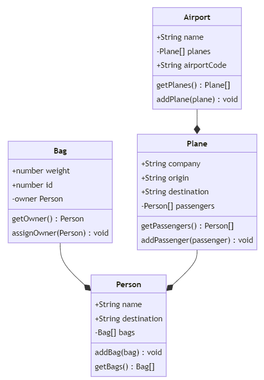

# Destination OOP 🛫
As you arrive at the airport, your excitement grows. You're not just going on a trip, but embarking on an adventure into the world of Object-Oriented Programming. Your destination? Creating classes and unit tests for airports, persons, planes, and bags.

In this activity, you'll be practicing object-oriented programming (OOP) by creating classes with attributes and methods that model real-world entities. Additionally, you'll also be writing unit tests to ensure that they're functioning as expected. By the end of this activity, you'll have not only a solid understanding of OOP principles but also a set of classes that you can use to build more complex programs in the future. So let's get ready to take off and start coding!

**GOAL**: You should:
- Write tests for each class in the corresponding test file in the `__tests__` folder (e.g. Bag tests should be written in Bag.test.js)
- Create code that meets the design specifications outlined in the class diagram above and the more detailed specs outlined below.
- Feel free to try your code out by importing classes in `main.js` and creating some instances in the `main()` function.

## `Bag`

1. In `Bag.test.js`, import the `Bag` class from `Bag.js` (it has already been exported for you).
2. In `Bag.test.js`, construct the tests that will verify that you have included all of the required components outlined in the class diagram above. A few to consider using:
    - Test that you can create an instance of the `Bag` class
    - Test that the `weight` and `id` have been assigned correctly.
    - `owner`: The person assigned to a `Bag`. Initialized with a value of `null`.
    - Verify you can get the initial `owner` using `getOwner`.
    - Create a test to update `owner` with a `Person` assigned to a `Bag` using `assignOwner()`. You won't be able to assign a person until you completing the next section.
3. In `Bag.js`, create code that meets the following specifications:
    - **Properties**
        - `weight`: The weight of the bag.
        - `id`: An id for the bag.
    - **Methods**
        - `getOwner()`: Returns the `Person` assigned to the bag.
        - `assignOwner(person)` Updates `owner` with a `person` assigned to a `Bag`.
4. Verify your tests work by running `npm test ./__tests__/classes/Bag.test.js`. 

## `Person`

1. In `Person.test.js`, import the `Person` class from `Person.js` that has been created for you.
2. In `Person.test.js`, construct the tests that will verify that you have included all of the required components outlined in the class diagram above. A few to consider using:
    - Test that you can create an instance of the `Person` class
    - Test that the `name` and `destination` have been assigned correctly.
    - Test that `bags` initializes as an empty array.
    - Test that `addBag()` adds a bag to the `bags` array.
3. In `Person.js`, create code that meets the following specifications:
    - **Properties**
        - `name`: The name of the person.
        - `destination`: The destination the person is traveling to.
        - `bags`: An array of `Bag` instances assigned to this person. This should initialize as an empty array.
    - **Methods**
        - `addBag(bag)`: Updates the `bags` array with a bag.
        - `getBags()`: Returns the array of `bags.
4. Verify your tests work by running `npm test ./__tests__/classes/Person.test.js`. 

## `Plane`

1. In `Plane.test.js`, import the `Plane` class from `Plane.js` that has been created for you.
2. In `Plane.test.js`, construct the tests that will verify that you have included all of the required components outlined in the class diagram above. A few to consider using:
    - Test that `company`, `origin`, and `destination` are assigned to the correct value.
    - Check that the `passengers` array initializes as an empty array.
    - Verify that you can add a `Person` to the `passengers` array using `addPassenger`.
3. In `Plane.js`, create code that meets the following specifications:
    - **Properties**
        - `company`: The company that operates the Plane.
        - `origin`: The origin set to the static property of `Airport.airportCode` (created in the next section).
        - `destination`: The destination the plane is traveling to.
        - `passengers`: An array of `Passenger` instances assigned to this plane. This should initialize as an empty array.
    - **Methods**
        - `getPassengers()`: Returns the array of `passengers`.
        - `addPassenger(passenger)`: Adds the `passenger` to the `passengers` array. 
4. Verify your tests work by running `npm test ./__tests__/classes/Plane.test.js`. 

## `Airport`
1. In `Airport.test.js`, import the `Airport` class from `Airport.js` that has been created for you.
2. In `Airport.test.js`, construct the tests that will verify that you have included all of the required components outlined in the class diagram above. A few to consider using:
    - Test that `name` and `planes` are assigned to the correct value.
    - Test that `airportCode` is the correct value
    - Check that the `planes` array initializes as an empty array.
    - Verify that you can add `Plane` objects to the planes array using `addPlane`.
3. In `Plane.js`, create code that meets the following specifications:
    - **Properties**
        - `name`: The name of the Airport.
        - `airportCode`: A static property with the three letter code for the airport (e.g. JFK or LHR).
        - `planes`: An array of `Plane` objects currently at the airport. Initializes as an empty array.
    - **Methods**
        - `getPlanes()`: Returns the array of `planes`.
        - `addPlane(plane)`: Adds the `plane` to the `planes` array. 
4. Verify your tests work by running `npm test ./__tests__/classes/Airport.test.js`. 
